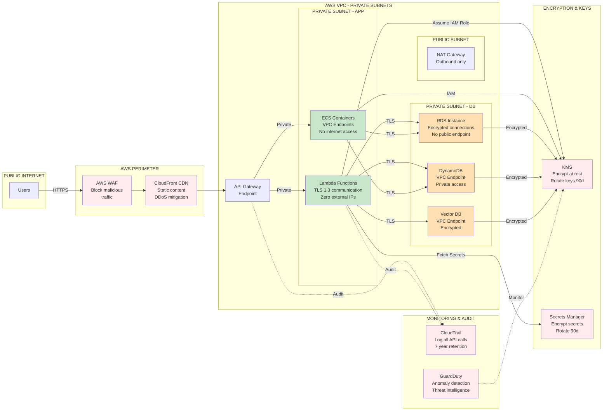

# Enterprise AI Complaint Intelligence Platform - Architecture Diagram

## System Architecture Overview

```mermaid
graph TB
    subgraph "CLIENT LAYER"
        WEB["Web Frontend<br/>(React/Vue)<br/>Real-time UI"]
        MOBILE["Mobile App<br/>(Optional)"]
    end

    subgraph "SECURITY & GATEWAY"
        WAF["AWS WAF<br/>DDoS Protection"]
        APIGW["API Gateway<br/>Rate Limiting<br/>Authentication<br/>Request Validation"]
        AUTHSVC["Auth Service<br/>(Cognito + Custom)<br/>RBAC Enforcement"]
    end

    subgraph "BACKEND MICROSERVICES"
        SUMMARYSVC["Summarization Service<br/>(Lambda/ECS)<br/>- Call Processing<br/>- Transcript Ingestion<br/>- Multi-tier Summaries"]
        RESOLUTIONSVC["Resolution Service<br/>(Lambda/ECS)<br/>- Recommendation Engine<br/>- RAG Orchestration<br/>- Precedent Lookup"]
        COMPLAINTAPI["Complaint Management API<br/>(Lambda/ECS)<br/>- CRUD Operations<br/>- Status Tracking<br/>- Data Aggregation"]
        AUDITAPI["Audit & Compliance API<br/>(Lambda/ECS)<br/>- Logging<br/>- Access Control<br/>- Compliance Reports"]
    end

    subgraph "AI AGENTS & ORCHESTRATION"
        AIORCHESTRATOR["Multi-Agent Orchestrator<br/>(Lambda Step Functions)<br/>- Agent Routing<br/>- Prompt Management<br/>- Quality Control"]
        SUMMARYAGENT["Summarization Agent<br/>(Bedrock Claude)<br/>- NLP Processing<br/>- Multi-language Support<br/>- Hallucination Detection"]
        RESAGENT["Resolution Agent<br/>(Bedrock Claude)<br/>- RAG Integration<br/>- Confidence Scoring<br/>- Source Citation"]
    end

    subgraph "DATA & VECTOR LAYER"
        DYNAMODB["DynamoDB<br/>- Complaints Table<br/>- Summaries Cache<br/>- Recommendations Log<br/>- TTL Policies"]
        RDS["RDS PostgreSQL<br/>- Audit Logs<br/>- User Data<br/>- Compliance Records<br/>- Historical Analytics"]
        S3RECORDINGS["S3 Bucket<br/>- Call Recordings<br/>- Transcripts<br/>- Backup Storage<br/>Default Encryption"]
        VECTORDB["OpenSearch Vector DB<br/>- Historical Cases Index<br/>- Embeddings Storage<br/>- Semantic Search<br/>- HNSW Index"]
        CACHE["ElastiCache Redis<br/>- API Response Cache<br/>- Session Store<br/>- Embedding Cache<br/>- 15-min TTL"]
    end

    subgraph "AI/ML INFRASTRUCTURE"
        BEDROCK["AWS Bedrock<br/>- Claude 3 Models<br/>- Token Budgeting<br/>- Rate Limiting"]
        EMBEDDINGS["SageMaker Endpoint<br/>- Embedding Model<br/>- Auto-scaling<br/>- Multi-GPU"]
        FEATURE["SageMaker Feature Store<br/>- Historical Case Features<br/>- Metadata Enrichment"]
    end

    subgraph "ASYNC PROCESSING & EVENTS"
        SQS["SQS Queues<br/>- Summarization Jobs<br/>- RAG Indexing<br/>- Batch Processing<br/>DLQ for Failures"]
        SNS["SNS Topics<br/>- Complaint Created<br/>- Resolution Ready<br/>- Error Notifications<br/>- Audit Events"]
        KINESIS["Kinesis Data Stream<br/>- Real-time Events<br/>- Compliance Stream<br/>- Analytics Feed"]
        WORKERS["Lambda Workers<br/>- Async Job Processor<br/>- Batch Summarizer<br/>- Vector Indexer<br/>- Report Generator"]
    end

    subgraph "MONITORING & OBSERVABILITY"
        CLOUDWATCH["CloudWatch<br/>- Logs (7-year retention)<br/>- Metrics & Dashboards<br/>- Alarms & Thresholds"]
        XRAY["X-Ray<br/>- Distributed Tracing<br/>- Service Map<br/>- Latency Analysis"]
        CLOUDTRAIL["CloudTrail<br/>- API Audit Log<br/>- User Activity<br/>- Resource Changes"]
        GUARDDUTY["GuardDuty<br/>- Threat Detection<br/>- Anomaly Analysis<br/>- Security Insights"]
    end

    subgraph "SECURITY & COMPLIANCE"
        KMS["KMS<br/>- Master Keys<br/>- Encryption at Rest<br/>- Key Rotation"]
        SECRETS["Secrets Manager<br/>- API Keys<br/>- DB Credentials<br/>- Model Tokens"]
        VPC["VPC<br/>- Private Subnets<br/>- Security Groups<br/>- NACLs<br/>- Bastion Host"]
        WAF2["Config Rules<br/>- Compliance Monitoring<br/>- Auto Remediation"]
    end

    subgraph "DATA PIPELINE & ANALYTICS"
        GLUE["Glue Crawler<br/>- Data Cataloging<br/>- Schema Detection"]
        ATHENA["Athena<br/>- Ad-hoc SQL Queries<br/>- Data Lake Analysis"]
        QUICKSIGHT["QuickSight<br/>- Executive Dashboard<br/>- Real-time Charts<br/>- Drill-down Reports"]
        REDSHIFT["Redshift (Optional)<br/>- Historical Analytics<br/>- BI Integration"]
    end

    %% CLIENT to GATEWAY
    WEB --> WAF
    MOBILE --> WAF
    WAF --> APIGW

    %% GATEWAY to AUTH
    APIGW --> AUTHSVC

    %% AUTH & GATEWAY to SERVICES
    AUTHSVC --> SUMMARYSVC
    AUTHSVC --> RESOLUTIONSVC
    AUTHSVC --> COMPLAINTAPI
    AUTHSVC --> AUDITAPI

    %% SERVICES to ORCHESTRATOR
    SUMMARYSVC --> AIORCHESTRATOR
    RESOLUTIONSVC --> AIORCHESTRATOR

    %% ORCHESTRATOR to AGENTS
    AIORCHESTRATOR --> SUMMARYAGENT
    AIORCHESTRATOR --> RESAGENT

    %% AGENTS to AI INFRASTRUCTURE
    SUMMARYAGENT --> BEDROCK
    RESAGENT --> BEDROCK
    RESAGENT --> EMBEDDINGS
    RESAGENT --> VECTORDB

    %% SERVICES to DATA LAYER
    COMPLAINTAPI --> DYNAMODB
    COMPLAINTAPI --> RDS
    SUMMARYSVC --> S3RECORDINGS
    RESOLUTIONSVC --> VECTORDB
    COMPLAINTAPI --> CACHE
    AUDITAPI --> RDS

    %% AGENTS to DATA
    SUMMARYAGENT --> DYNAMODB
    RESAGENT --> DYNAMODB
    RESAGENT --> FEATURE

    %% SERVICES to ASYNC
    SUMMARYSVC --> SQS
    RESOLUTIONSVC --> SQS
    COMPLAINTAPI --> SNS
    AUDITAPI --> SNS
    AIORCHESTRATOR --> KINESIS

    %% ASYNC PROCESSING
    SQS --> WORKERS
    SNS --> WORKERS
    WORKERS --> DYNAMODB
    WORKERS --> VECTORDB
    WORKERS --> S3RECORDINGS

    %% KINESIS to ANALYTICS
    KINESIS --> ATHENA
    KINESIS --> QUICKSIGHT

    %% DATA PIPELINE
    DYNAMODB --> GLUE
    RDS --> GLUE
    S3RECORDINGS --> GLUE
    GLUE --> ATHENA
    ATHENA --> QUICKSIGHT
    ATHENA --> REDSHIFT

    %% MONITORING
    SUMMARYSVC -.->|Logs| CLOUDWATCH
    RESOLUTIONSVC -.->|Logs| CLOUDWATCH
    COMPLAINTAPI -.->|Logs| CLOUDWATCH
    AUDITAPI -.->|Logs| CLOUDWATCH
    WORKERS -.->|Logs| CLOUDWATCH
    AIORCHESTRATOR -.->|Logs| CLOUDWATCH

    SUMMARYSVC -.->|Traces| XRAY
    RESOLUTIONSVC -.->|Traces| XRAY
    AIORCHESTRATOR -.->|Traces| XRAY

    APIGW -.->|API Calls| CLOUDTRAIL
    AUTHSVC -.->|Auth Events| CLOUDTRAIL
    BEDROCK -.->|Token Usage| CLOUDWATCH

    DYNAMODB -.->|Security| GUARDDUTY
    RDS -.->|Security| GUARDDUTY
    VECTORDB -.->|Security| GUARDDUTY

    %% SECURITY
    DYNAMODB --> KMS
    RDS --> KMS
    S3RECORDINGS --> KMS
    VECTORDB --> KMS
    
    SUMMARYSVC --> SECRETS
    RESOLUTIONSVC --> SECRETS
    COMPLAINTAPI --> SECRETS
    
    APIGW --> VPC
    SUMMARYSVC --> VPC
    RESOLUTIONSVC --> VPC
    COMPLAINTAPI --> VPC
    WORKERS --> VPC

    DYNAMODB --> WAF2
    RDS --> WAF2
    S3RECORDINGS --> WAF2

    %% COMPLIANCE
    AUDITAPI -.->|Audit Trail| CLOUDTRAIL
    AIORCHESTRATOR -.->|Decision Log| RDS

    style WEB fill:#e1f5ff
    style MOBILE fill:#e1f5ff
    style WAF fill:#fff3e0
    style APIGW fill:#fff3e0
    style AUTHSVC fill:#fff3e0
    style SUMMARYSVC fill:#c8e6c9
    style RESOLUTIONSVC fill:#c8e6c9
    style COMPLAINTAPI fill:#c8e6c9
    style AUDITAPI fill:#c8e6c9
    style AIORCHESTRATOR fill:#f3e5f5
    style SUMMARYAGENT fill:#f3e5f5
    style RESAGENT fill:#f3e5f5
    style DYNAMODB fill:#ffe0b2
    style RDS fill:#ffe0b2
    style S3RECORDINGS fill:#ffe0b2
    style VECTORDB fill:#ffe0b2
    style CACHE fill:#ffe0b2
    style BEDROCK fill:#c5cae9
    style EMBEDDINGS fill:#c5cae9
    style FEATURE fill:#c5cae9
    style SQS fill:#ffccbc
    style SNS fill:#ffccbc
    style KINESIS fill:#ffccbc
    style WORKERS fill:#ffccbc
```



---

## Detailed Component Descriptions

### 1. CLIENT LAYER
- **Web Frontend**: React/Vue.js SPA with real-time updates via WebSockets
- **Mobile App**: Optional native app for support agents (iOS/Android)
- **Features**: Live complaint dashboard, recommendation viewing, audit trail access

### 2. SECURITY & GATEWAY
- **AWS WAF**: Protects against DDoS, injection attacks, rate limiting
- **API Gateway**: REST endpoints, request validation, throttling, CORS handling
- **Auth Service**: Cognito + custom auth for role-based access control (RBAC)

### 3. BACKEND MICROSERVICES
- **Summarization Service**: Processes call recordings → generates summaries (executive, detailed, key metrics)
- **Resolution Service**: Queries historical cases → returns ranked recommendations with confidence scores
- **Complaint Management API**: CRUD for complaints, status tracking, data aggregation
- **Audit & Compliance API**: Logs all operations, generates compliance reports, enforces access policies

### 4. AI AGENTS & ORCHESTRATION
- **Multi-Agent Orchestrator**: Step Functions workflow managing agent routing, prompt optimization, quality gates
- **Summarization Agent**: Claude 3 + NLP for call transcript analysis (supports 10+ languages, hallucination detection)
- **Resolution Agent**: Claude 3 + RAG for recommendation engine (cites historical precedents, confidence scoring)

### 5. DATA & VECTOR LAYER
- **DynamoDB**: Primary NoSQL store for complaints, summaries, recommendations (high throughput, auto-scaling)
- **RDS PostgreSQL**: ACID compliance for audit logs, user data, analytics queries (backup daily, 30-day retention)
- **S3**: Call recordings, transcripts, compliance backups (default encryption, lifecycle policies)
- **OpenSearch Vector DB**: Semantic search over 100K+ historical cases (HNSW index, 1536-dim embeddings)
- **ElastiCache Redis**: API response cache, session store, embedding cache (15-min TTL, auto-failover)

### 6. AI/ML INFRASTRUCTURE
- **AWS Bedrock**: Claude 3 Opus/Sonnet models, provisioned throughput, token budgeting
- **SageMaker Endpoint**: Custom embedding model with auto-scaling (Multi-GPU instances)
- **Feature Store**: Pre-computed case features for RAG filtering (updated daily)

### 7. ASYNC PROCESSING & EVENTS
- **SQS**: Job queues for summarization, batch processing, RAG indexing (DLQ for failures)
- **SNS**: Event notifications (complaint created, resolution ready, error alerts)
- **Kinesis**: Real-time event stream for compliance monitoring and analytics
- **Lambda Workers**: Async jobs (summarization, vector indexing, report generation)

### 8. MONITORING & OBSERVABILITY
- **CloudWatch**: Centralized logging (7-year retention), metrics dashboard, alarms
- **X-Ray**: Distributed tracing across microservices, latency hotspot analysis
- **CloudTrail**: Immutable audit log of all API calls and user actions
- **GuardDuty**: Threat detection, anomaly analysis, security insights

### 9. SECURITY & COMPLIANCE
- **KMS**: Master encryption keys, automatic key rotation (CMK for each service)
- **Secrets Manager**: API keys, DB credentials, LLM tokens (90-day rotation)
- **VPC**: Private subnets, security groups, NACLs, bastion host for admin access
- **Config Rules**: Compliance monitoring, auto-remediation for misconfigurations

### 10. DATA PIPELINE & ANALYTICS
- **Glue**: Crawler for schema discovery, automated data cataloging
- **Athena**: Ad-hoc SQL queries on data lake (S3 + Glue catalog)
- **QuickSight**: Executive dashboard (complaint trends, resolution effectiveness, AI accuracy metrics)
- **Redshift** (Optional): Historical data warehouse for BI integration

---

## Data Flow Examples

### Flow 1: Complaint Summarization (Sync Path)
```
1. Support Agent uploads call recording → S3
2. Frontend calls API Gateway → Summarization Service
3. Service retrieves recording from S3
4. Routes to LLM via Orchestrator → Bedrock
5. Claude returns multi-tier summary
6. Stores in DynamoDB, caches in Redis
7. Returns to frontend in <5 seconds
8. Async: publishes SNS event → triggers audit log
```

### Flow 2: AI-Powered Resolution Recommendation (Async Path)
```
1. Summary published → triggers SNS event
2. Resolution Service subscribes → picks up from SQS
3. Queries Vector DB for similar historical cases (RAG)
4. Sends context + summary to Claude via Bedrock
5. Claude returns ranked recommendations (top 3 with confidence)
6. Stores in DynamoDB with citation links
7. Publishes SNS event → notifies support manager
8. Manager reviews → accepts/rejects
9. Logs decision in RDS audit table
10. Kinesis streams event → QuickSight updates in real-time
```

### Flow 3: Compliance Audit Trail
```
Every operation logs:
1. User ID (from Cognito)
2. Action (e.g., "viewed recommendation")
3. Resource ID (complaint, recommendation)
4. Timestamp
5. IP address (from API Gateway)
6. Result (success/failure)
→ RDS audit table (immutable)
→ CloudTrail (AWS-managed)
→ CloudWatch Logs (searchable)
```

---

## Scalability & Performance Targets

| Component | Scale | Config |
|-----------|-------|--------|
| **API Gateway** | 10K req/sec | Throttle limits, auto-scaling |
| **Lambda Functions** | Concurrent capacity | Reserved concurrency: 1000 |
| **DynamoDB** | 100K complaints/day | On-demand throughput, auto-scaling |
| **Vector DB** | 500K+ historical cases | Replicated across 3 AZs, HNSW index |
| **LLM Inference** | 1000 req/min | Bedrock provisioned throughput |
| **Cache Hit Rate** | 70%+ | Redis 30GB cluster, multi-AZ |
| **Latency P99** | <2 seconds | API to response |

---

## High Availability & Disaster Recovery

**Multi-AZ Architecture**
- All services replicated across 3 availability zones
- RDS: Synchronous standby in different AZ (RTO: 2 min)
- S3: Cross-region replication to backup bucket
- OpenSearch: 3-node cluster with dedicated master

**Backup Strategy**
- DynamoDB: Continuous backups, point-in-time recovery (35 days)
- RDS: Automated snapshots every 6 hours, 30-day retention
- S3: Versioning enabled, lifecycle to Glacier after 90 days
- Vector DB: Snapshots to S3 every 12 hours

**SLA Targets**
- Uptime: 99.9% (4.3 hours/month downtime)
- RTO: <4 hours (Recover all services)
- RPO: <1 hour (Recover data, <1 hour loss acceptable)

---

## Security Architecture



---

## Cost Optimization Strategy

| Service | Monthly Cost | Optimization |
|---------|--------------|--------------|
| **Bedrock (LLM)** | ~$5K | Token budgeting, prompt caching, batch jobs |
| **Lambda** | ~$2K | Reserved concurrency, efficient code |
| **DynamoDB** | ~$1.5K | On-demand, auto-scaling, TTL policies |
| **RDS** | ~$800 | Reserved instances (1-year), compute optimization |
| **OpenSearch Vector DB** | ~$2K | r6g instances, reserved capacity |
| **S3** | ~$600 | Intelligent tiering, lifecycle policies |
| **CloudWatch/X-Ray** | ~$500 | Log retention: 7 years, selective sampling |
| **Total Monthly** | ~$12.4K | |
| **Annual Cost** | ~$148.8K | |

---

## Deployment & CI/CD Pipeline

```mermaid
graph LR
    DEV["Developer<br/>Push to repo"]
    GIT["GitHub/CodeCommit<br/>Source control"]
    CI["CodePipeline<br/>Trigger on push"]
    BUILD["CodeBuild<br/>Compile, test<br/>Unit + Integration"]
    SCAN["Security Scan<br/>SAST, Secrets<br/>Dependency check"]
    DEPLOY_TEST["Deploy to Staging<br/>CloudFormation/CDK"]
    TEST_STAGE["Smoke Tests<br/>Performance Tests<br/>Security Tests"]
    APPROVAL["Manual Approval<br/>Security review<br/>Architecture review"]
    DEPLOY_PROD["Deploy to Production<br/>Blue/Green<br/>Canary rollout"]
    MONITOR["Monitoring<br/>Dashboards<br/>Alerts<br/>Rollback ready"]

    DEV --> GIT
    GIT --> CI
    CI --> BUILD
    BUILD --> SCAN
    SCAN --> DEPLOY_TEST
    DEPLOY_TEST --> TEST_STAGE
    TEST_STAGE --> APPROVAL
    APPROVAL --> DEPLOY_PROD
    DEPLOY_PROD --> MONITOR

    style DEV fill:#bbdefb
    style GIT fill:#bbdefb
    style CI fill:#c8e6c9
    style BUILD fill:#c8e6c9
    style SCAN fill:#ffccbc
    style DEPLOY_TEST fill:#f8bbd0
    style TEST_STAGE fill:#f8bbd0
    style APPROVAL fill:#fff9c4
    style DEPLOY_PROD fill:#c8e6c9
    style MONITOR fill:#b2dfdb
```



---

## Key Architectural Decisions (ADRs)

| Decision | Rationale |
|----------|-----------|
| **Serverless (Lambda + ECS)** | Auto-scaling, no ops overhead, cost-optimized for variable load |
| **DynamoDB + RDS Hybrid** | DynamoDB for hot data (complaints), RDS for audit/compliance (immutable) |
| **OpenSearch Vector DB** | Managed, HNSW indexing, semantic search scales to 500K+ documents |
| **Bedrock LLMs** | Fully managed, no training needed, multi-model support, cost-effective at scale |
| **Multi-AZ Active-Active** | HA without single point of failure, <2s failover time |
| **Event-Driven Async** | Decouples services, handles traffic spikes, enables audit trail |
| **Step Functions for Orchestration** | Visual workflows, error handling, state persistence, built-in retry |

---

**Diagram Version**: 1.0  
**Last Updated**: January 2026  
**Format**: Mermaid (compatible with GitHub, VS Code, Confluence)
